# 🚀 Smart HR Management System (.NET 8 | Layered Architecture | Enterprise-Ready)


---

# 📌 Overview

Smart HR Management System is an enterprise-level HR and administration management solution built using ASP.NET Core MVC following Layered Architecture principles.

The system provides secure authentication, dynamic role-based authorization, employee management, department management, and administrative control features.

---

# 🏗️ Architecture

The project follows Layered Architecture principles for scalability, maintainability, and clean separation of concerns.

```bash
Solution Structure

├── PL_Solution
│   ├── Controllers
│   ├── ViewModels
│   ├── Views
│   ├── Utilities
│   └── wwwroot
│
├── BLL_Solution
│   ├── DTOs
│   ├── Services
│   ├── Profiles
│   ├── Factories
│   └── Service Abstractions
│
├── DAL_Solution
│   ├── Data
│   ├── Models
│   ├── Repositories
│   └── Persistence
```

---

# ✨ Features

## 🔐 Authentication & Authorization

* Login & Registration System
* ASP.NET Core Identity
* Secure Authentication Flow
* Role-Based Authorization
* Dynamic Permissions Management
* Password Hashing
* Remember Me Functionality
* Email Confirmation
* Forgot Password Recovery via Email

## 👨‍💼 HR Management

* Employees Management
* Departments Management
* Users Management
* Roles Management
* Administrative Dashboard

## ⚡ Advanced Features

* AJAX Live Search
* Repository Pattern
* AutoMapper Integration
* Dependency Injection
* Layered Architecture
* Clean Separation of Concerns

---

# 🧰 Tech Stack

* ASP.NET Core MVC
* ASP.NET Core Identity
* Entity Framework Core
* SQL Server
* AutoMapper
* Bootstrap
* AJAX
* jQuery
* LINQ
* Dependency Injection

---

# ⚙️ Installation & Setup

## 1️⃣ Clone Repository

```bash
git clone https://github.com/mohamed-osman-mohamed/smart-hr-management-system.git
```

---

## 2️⃣ Configure Database

Update the connection string inside:

```bash
appsettings.json
```

---

## 3️⃣ Apply Migrations

```bash
dotnet ef database update
```

---

## 4️⃣ Run The Project

```bash
dotnet run
```

---

# 📸 Project Preview

## 🖥️ Home Page

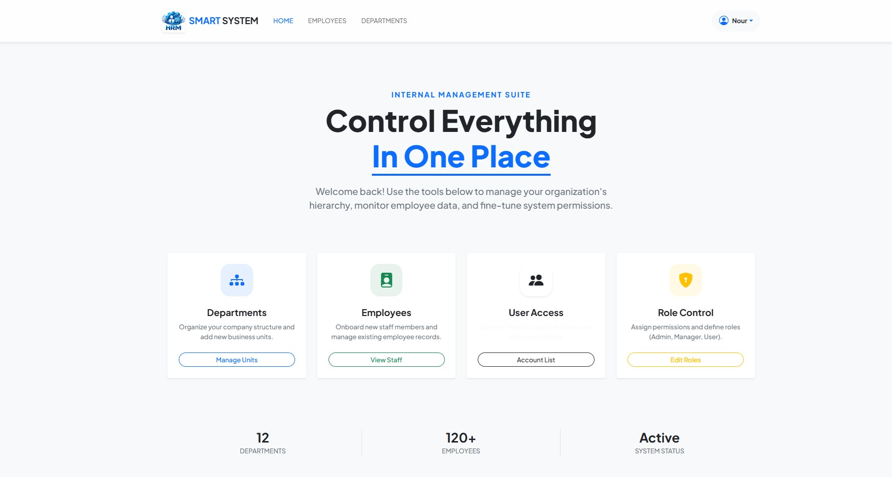

---

## 🔐 Login Page


---

## 📝 Registration Page

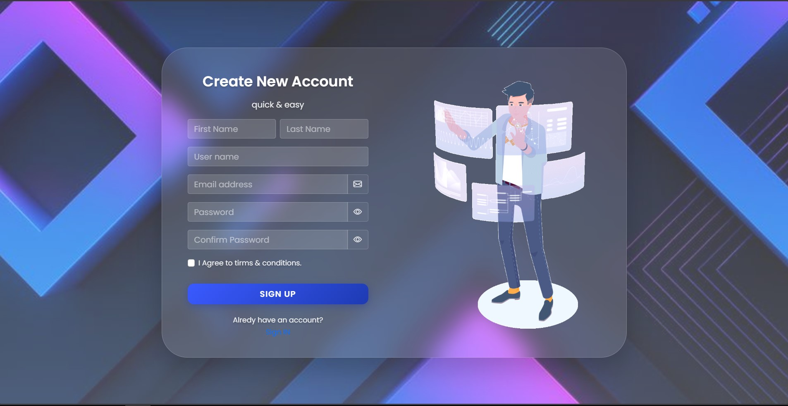

---

## 👨‍💼 Employees Management

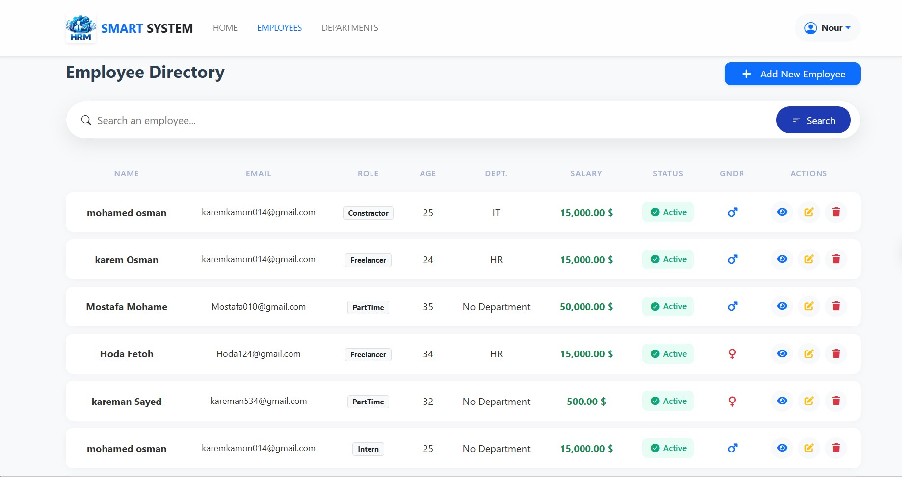

---

## ➕ Add New Employee

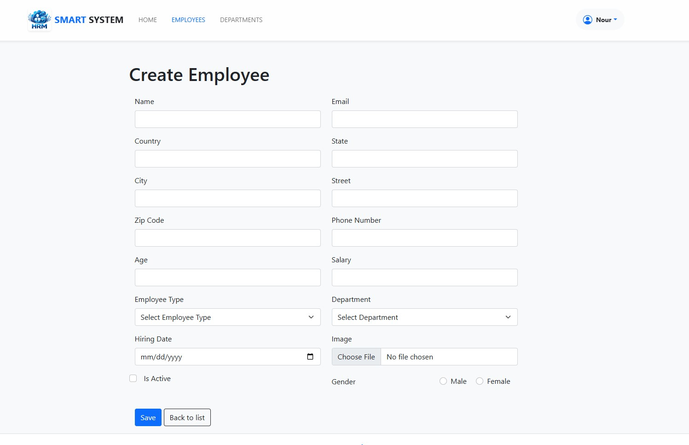

---

## ✏️ Edit Employee

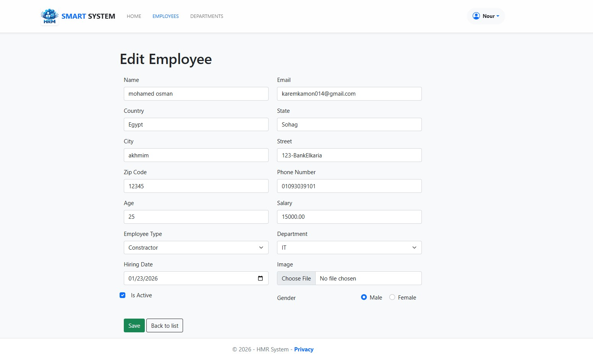

---

## 🗑️ Delete Employee

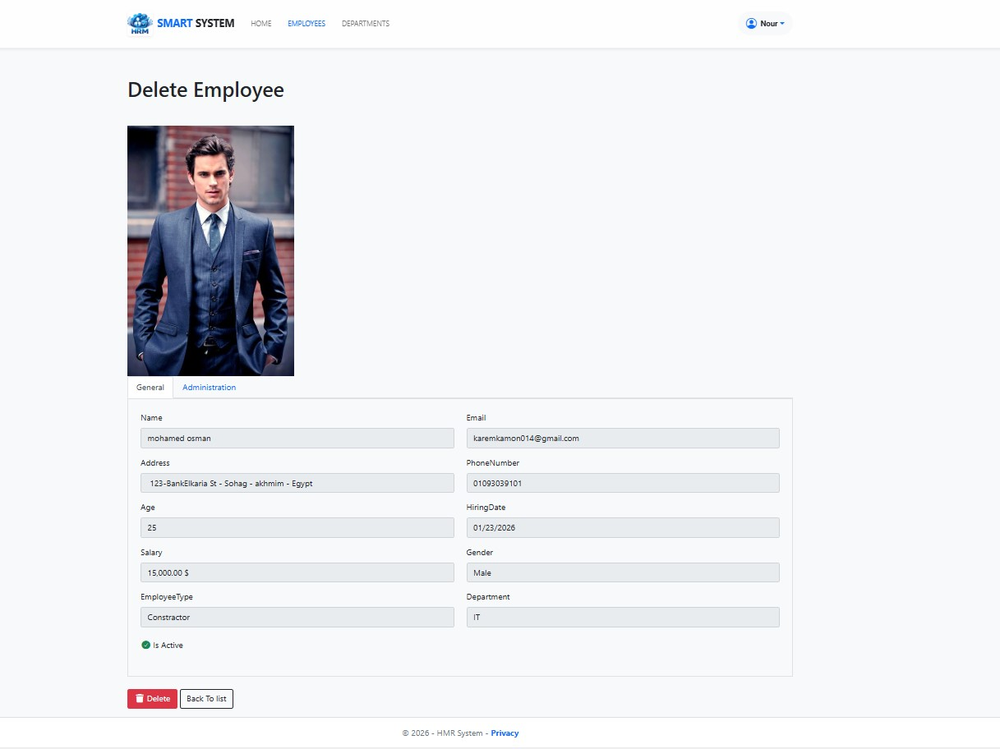

---

## 📄 Employee Details

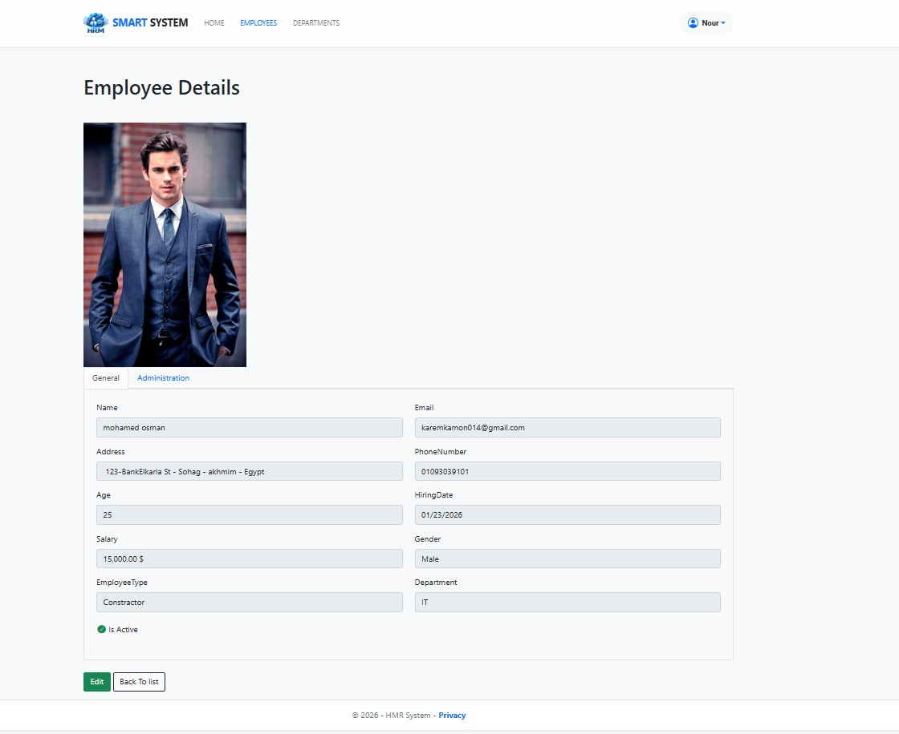

---

## 🏢 Departments Management

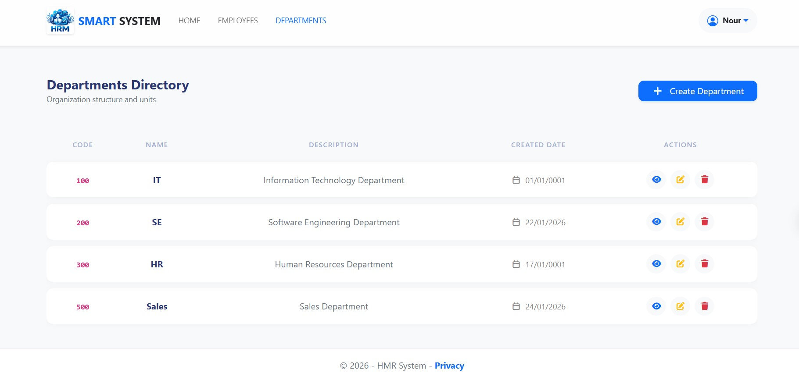

---

## ➕ Create Department

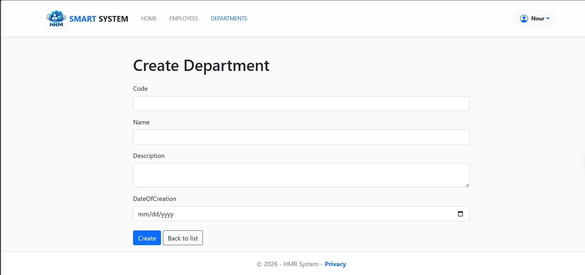

---

## ✏️ Edit Department

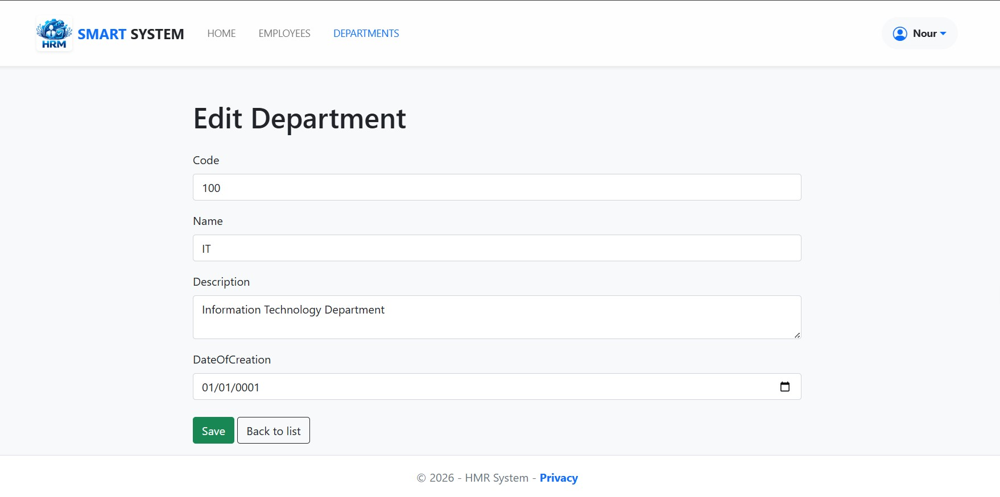

---

## 📄 Department Details

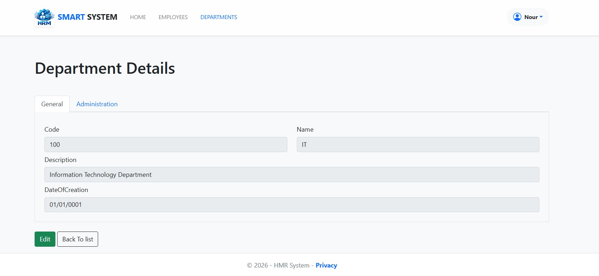

---

## 👥 Users Management

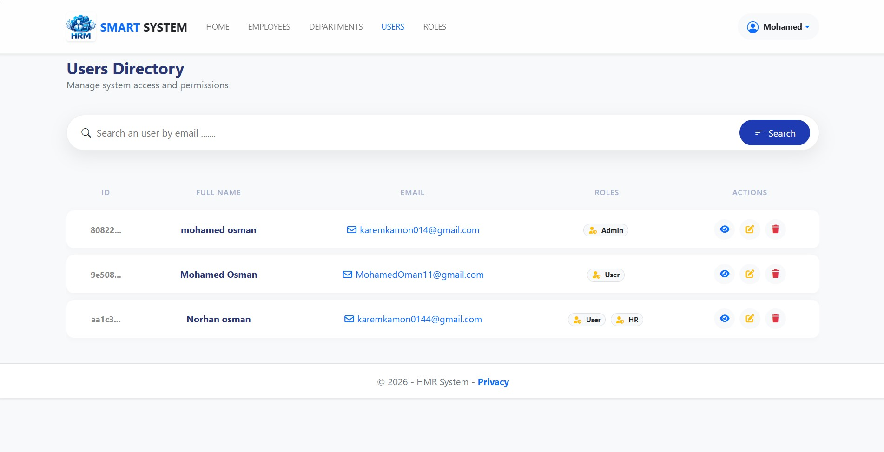

---

## ✏️ Edit User

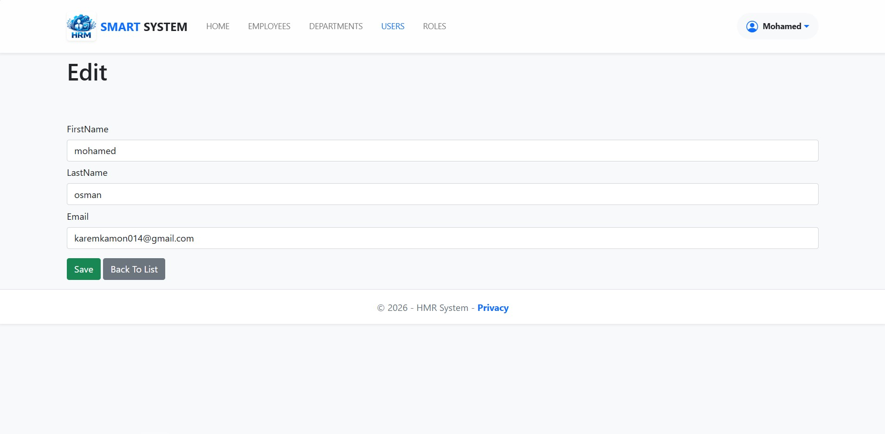

---

## 📄 User Details

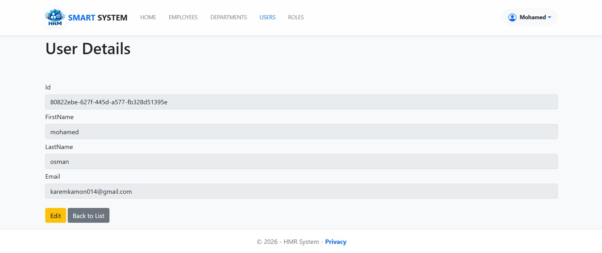

---

## 🛡️ Roles Management

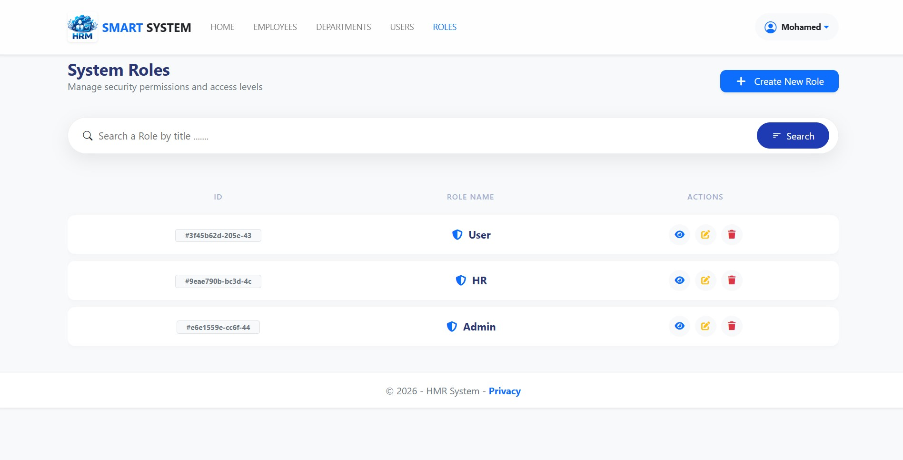

---

## ➕ Create Role

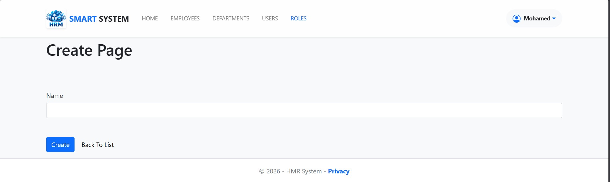

---

## 🔍 AJAX Live Search

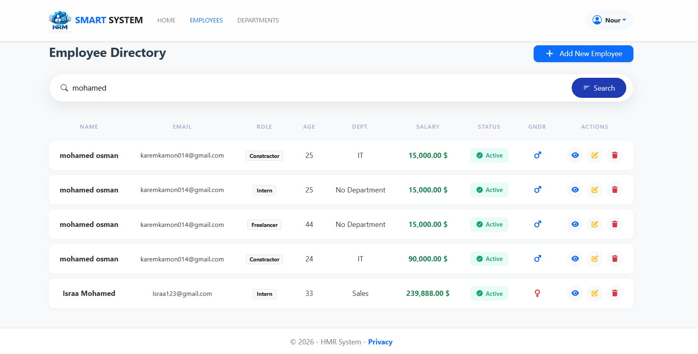

---

## 🔑 Forgot Password

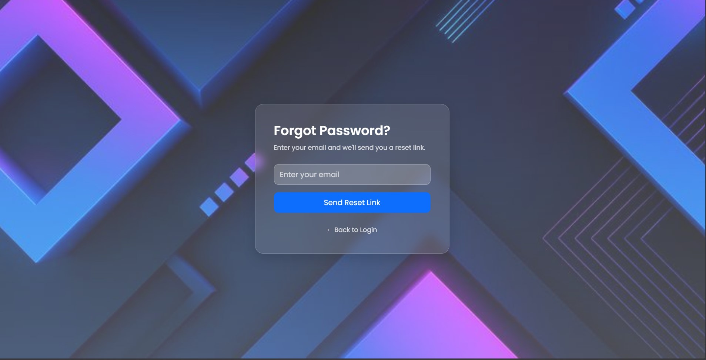

---

## 🖥️ Admin Dashboard

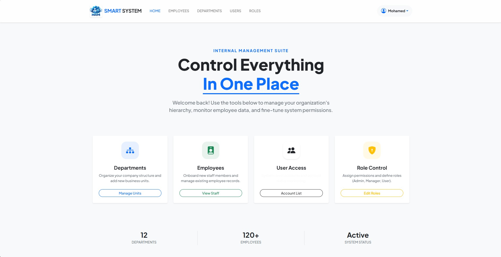

---

# 🚀 Future Improvements

* Audit Logging
* Export Reports
* Real-Time Notifications
* RESTful API Integration
* Advanced Analytics Dashboard

---

# 👨‍💻 Author

## Mohamed Osman

ASP.NET Core Backend Developer

* Passionate about Backend Engineering
* Interested in Enterprise Architecture
* Focused on Clean Code & Scalable Systems

---

# ⭐ Support

If you like this project, don't forget to give it a ⭐ on GitHub.
